# Rabobank Assignment for Team Native

## iOS App: Issues
### Description
Create an app that can visualize the contents of the attached CSV file on the screen.

### Requirements
- Correctly implemented, at community widely recognized, architecture, design
patterns, and technologies by your choice
- UI thread is not blocked during file reading, parsing or content browsing
- Code style and formatting
- High cohesion of modules
- Scalability without refactoring
- Performance aspects
- Unit Tests
- No irrelevant or dead code
- Code is concise, but production ready requiring no additional
touches to code.
- Ready for CSV files in size above 5MB
- Ready for malformed content

### As a bonus, you can impress us with:
- Advanced setup of the project
- The CSV parser created by yourself
- Nice looking UI
- UI Tests
- File selector to avoid hard-coded paths and ease validation
- If a Git repository is provided it contains more than initial commit

### Handoff
The result should be delivered as a link or email attachment

### Resources
- [Icons](https://www.flaticon.com/)

### Notes
- I have decided to implement the App using view code because scalability, performance, collaboration and production ready code.

### Possible Future Improvements
- Infinite scroll (if necessary)
- Encrypt sensible data
- Better error handling

### Commit history
---
### Initial commit
> Xcode initial commit

### Add gitignore file
> Gitignore configuration

### Initial project setup for view code
| Screenshot 01 (Light) | Screenshot 02 (Dark) |
| ------------- | ------------- |
|  |  |

### Initial Issues List screen
| Screenshot 03 (Light) | Screenshot 04 (Dark) |
| ------------- | ------------- |
| 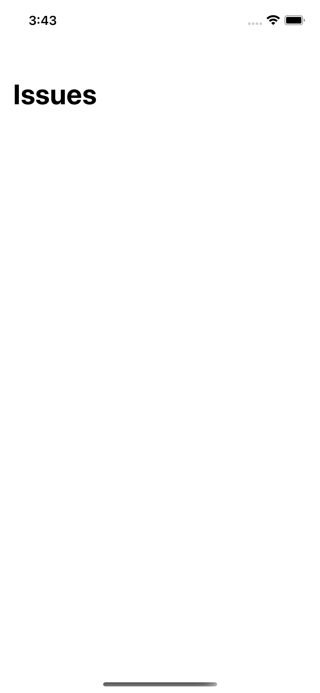 |  |

### Create reusable custom alert
| Screenshot 05 (Light) | Screenshot 06 (Dark) |
| ------------- | ------------- |
| 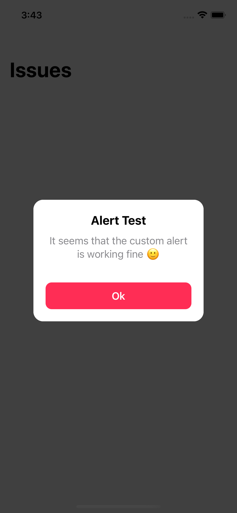 | 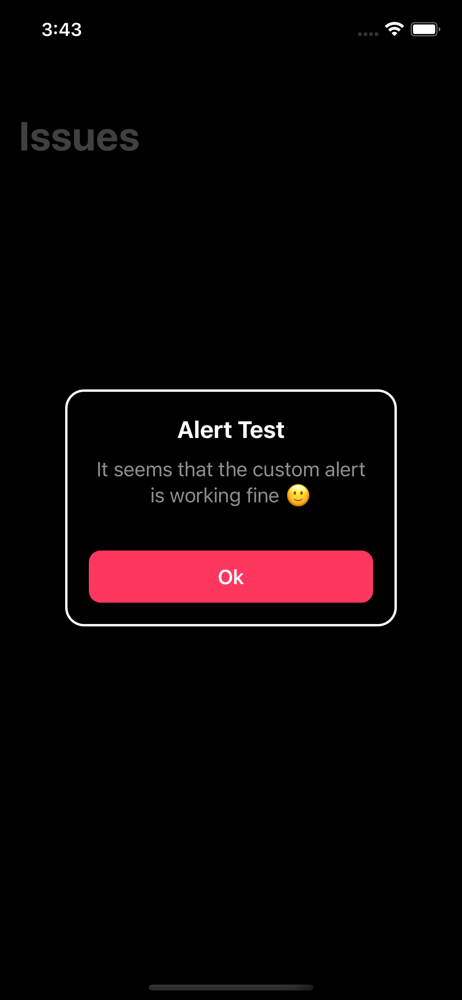 |

### Project organization. Accent color
> In here I just organize the files of the app and configure accent color
 
### Create file manager mock function - Get issues
> In here I create the file manager layer of the App and the get issues mock function

### Read data from CSV file
> In here I configure manager and model to read from the CSV file

### Issues List collection view initial setup
| Screenshot 07 (Light) | Screenshot 08 (Dark) |
| ------------- | ------------- |
| 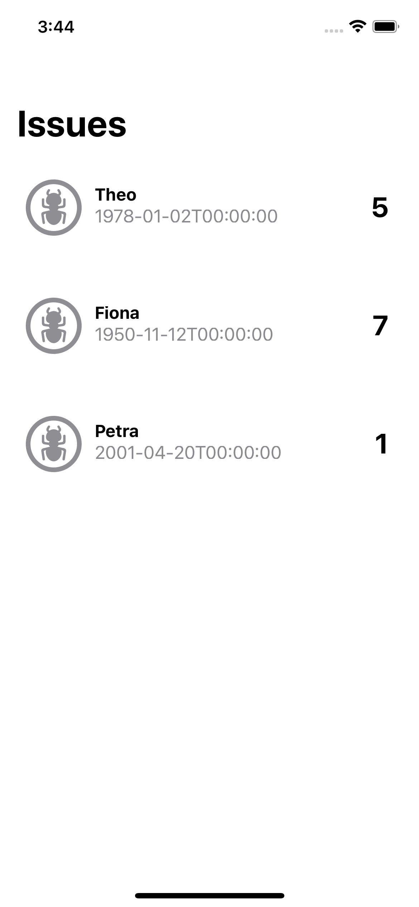 |  |

### Fix: ARC memory leaks. Refactor: flow layout UIHelper
> Avoid retain cycles and improve the collectionView flowLayout code

### Loading view
| Screenshot 09 (Light) | Screenshot 10 (Dark) |
| ------------- | ------------- |
| 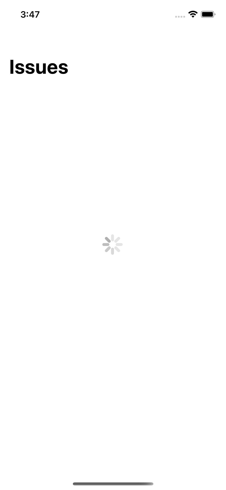 | 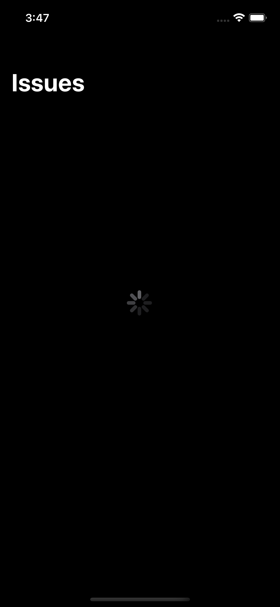 |

### Empty state view
| Screenshot 11 (Light) | Screenshot 12 (Dark) |
| ------------- | ------------- |
| 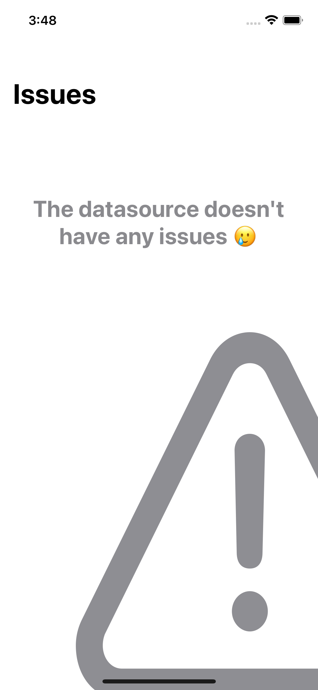 | 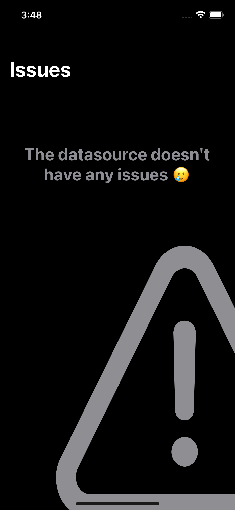 |

### Refactor - Extract SFSymbols
> Use system images with a common enumeration wrapper

### Search functionality
| Screenshot 13 (Light) | Screenshot 14 (Dark) |
| ------------- | ------------- |
| 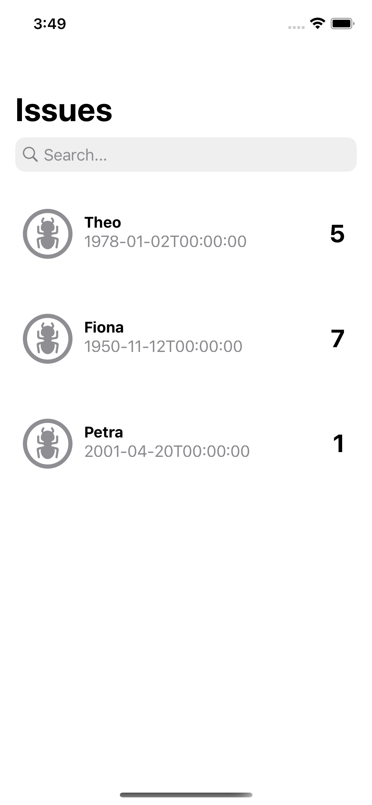 | 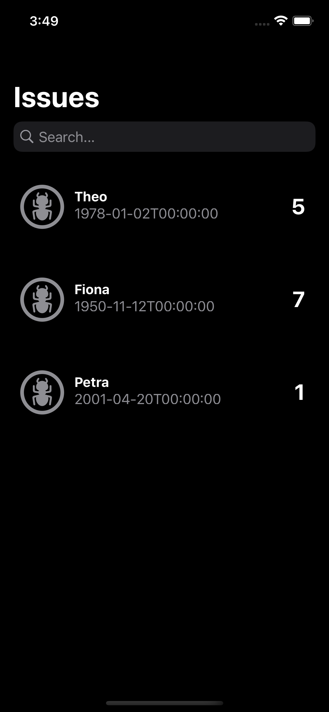 |

### Add full name to model
| Screenshot 15 (Light) | Screenshot 16 (Dark) |
| ------------- | ------------- |
| 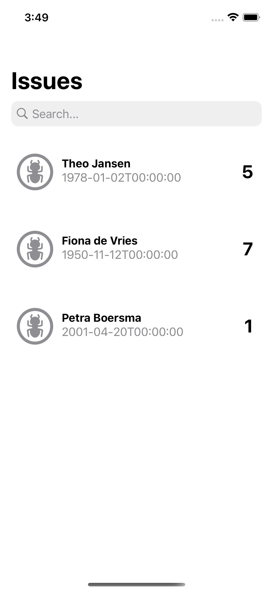 | 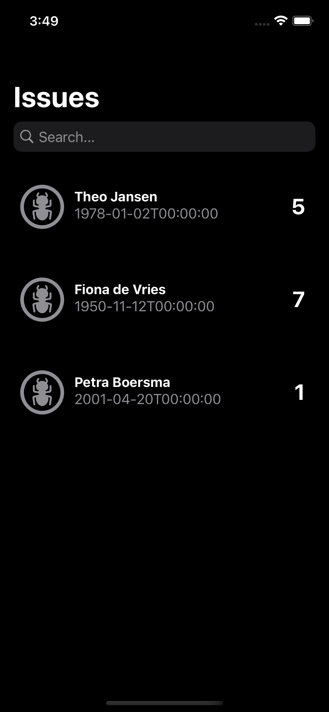 |

### Refactor #1
* Create convenience inits
* Extract custom container view
* Use inheritance to extend view controllers

### Refactor #2
* Clean up code inside .success
* Variadic parameters to add subviews
* Simplify SFSymbols enum

### Refactor #3
> Code structure and readability

### Configure UI
| Screenshot 17 (Light) | Screenshot 18 (Dark) |
| ------------- | ------------- |
| 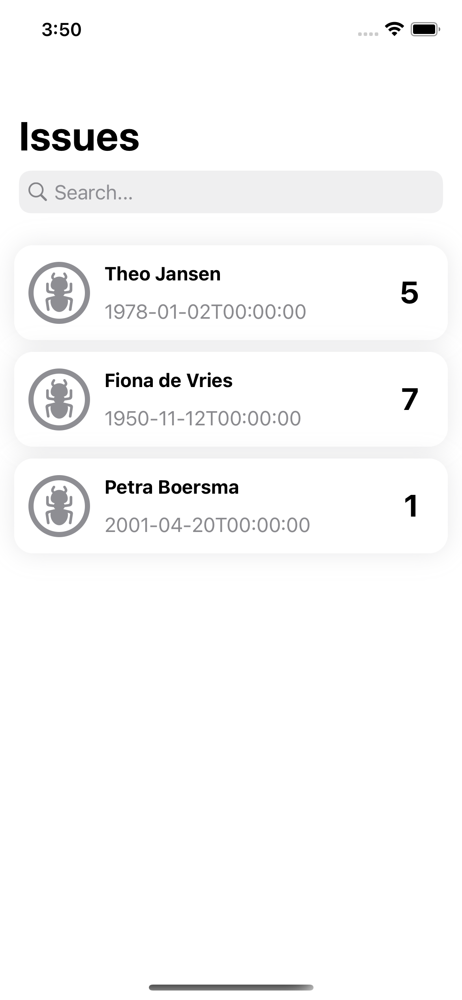 | 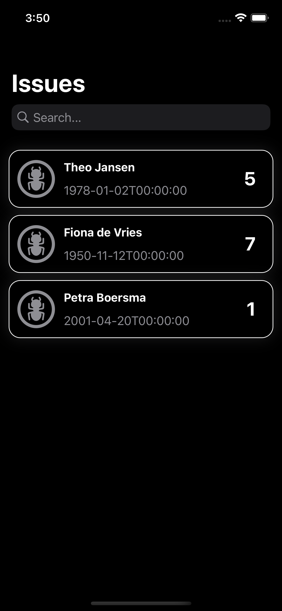 |

### Refactor #4
> Avoid literal based APIs using constants

### Add icon and launch screen
| Screenshot 19 (App icon) | Screenshot 20 (Launch screen) |
| ------------- | ------------- |
| 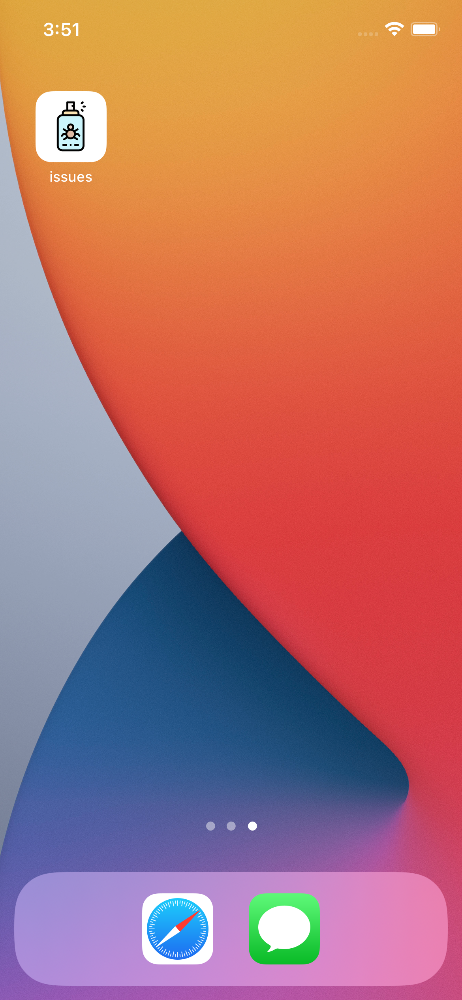 | 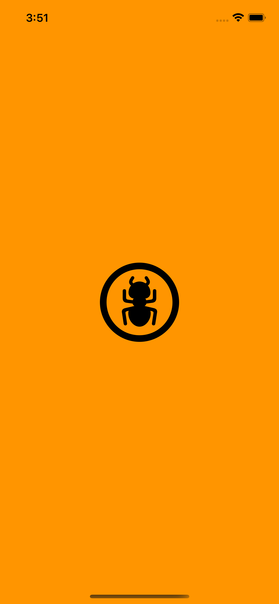 |

### Unit tests
> Example of issue model unit test

### Ready for read large files
> Read the file data by chunks

### Date of birth formatting
| Screenshot 21 (App icon) | Screenshot 22 (Launch screen) |
| ------------- | ------------- |
| 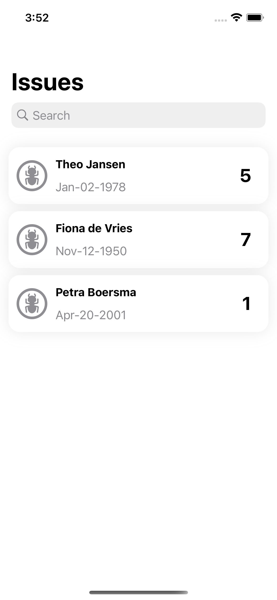 | 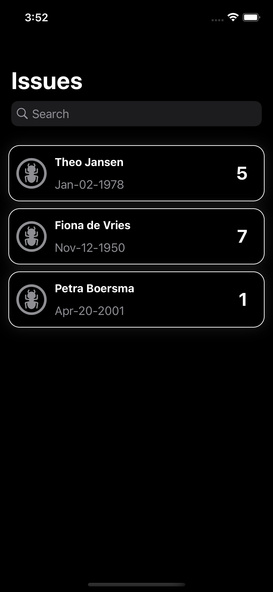 |

### MVVM on List Issues screen
> Implement MVVM architecture on the list issues screen

### Order issues by full name
| Screenshot 23 (App icon) | Screenshot 24 (Launch screen) |
| ------------- | ------------- |
| 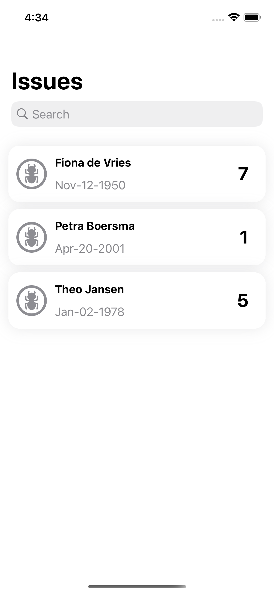 | 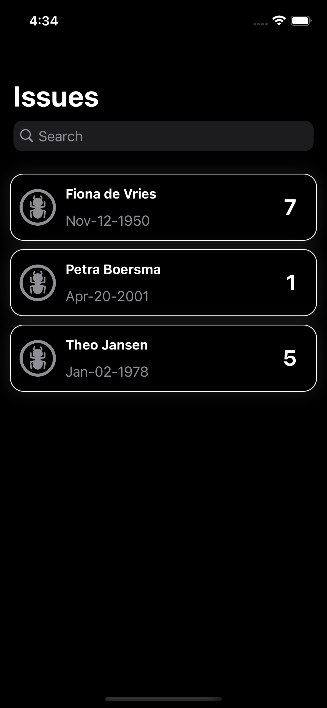 |

### Refactor #5
* Convenience init on model extension
* Extract file manager data read
* Add cell layout constants

### Refactor #6
> Managers

### Added managers
> File type manager on view model injection

### File read manager tests
> Tests for the read manager class

### CSV file manager tests
> Tests for the CSV file manager class

### File issues manager tests
> Tests for the file issues manager class

### UI tests configuration
> Bundle and scheme configuration for UI tests

### UI tests
> UI tests for App and UI elements

### Localization
> Added localization file (english only) and extensions
